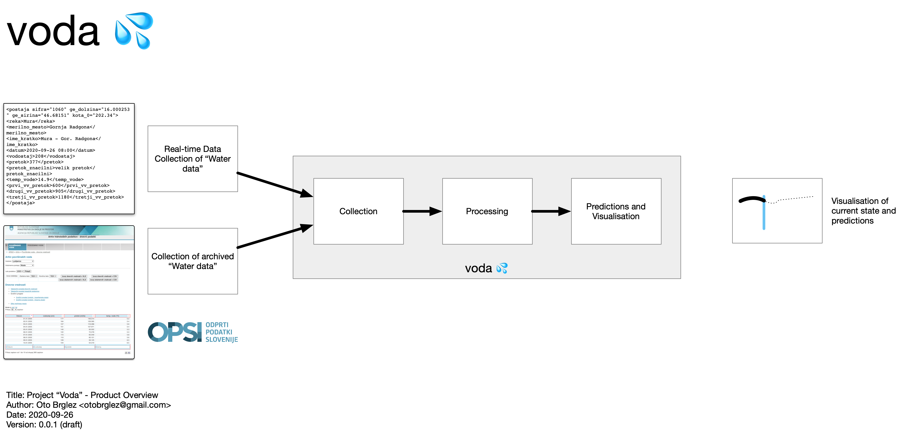
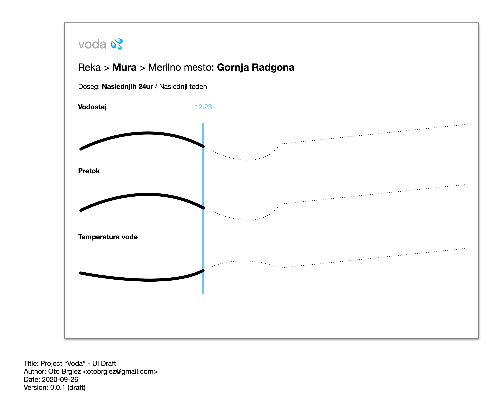
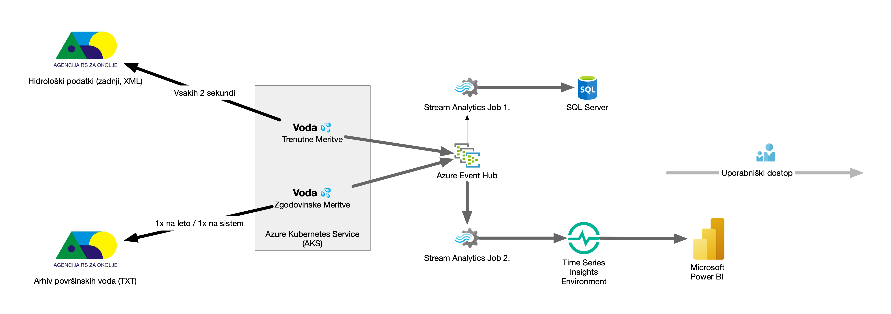

# voda 💦


Experimenting with following [ARSO](http://www.arso.gov.si) services and Open-data Sources,...

- [Hidrološki podatki - Dnevni v XML](http://www.arso.gov.si/xml/vode/hidro_podatki_dnevno_porocilo.xml)
- [Hidrološki podatki - Zadnji v XML](http://www.arso.gov.si/xml/vode/hidro_podatki_zadnji.xml)
- [Arhiv hidroloških podatkov - dnevni podatki - (HTML/TXT)](http://vode.arso.gov.si/hidarhiv/pov_arhiv_tab.php)

## Project
### Product Idea


### User Interface Idea


### Architecture (PoC)


# Deployment (WIP 🛠)
## Usage with Docker

```bash
$ docker pull ghcr.io/pinkstack/voda:latest
$ docker run --rm ghcr.io/pinkstack/voda
```

## Development from source

```bash
$ sbt compile assembly
$ java -jar target/*/voda.jar
```

## Author

- [Oto Brglez](https://github.com/otobrglez)
