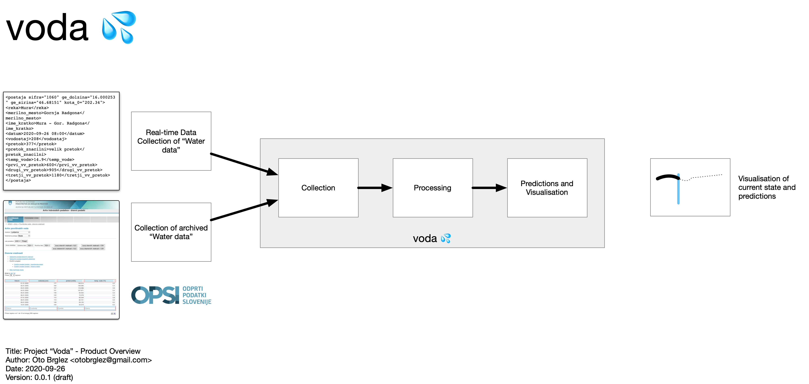
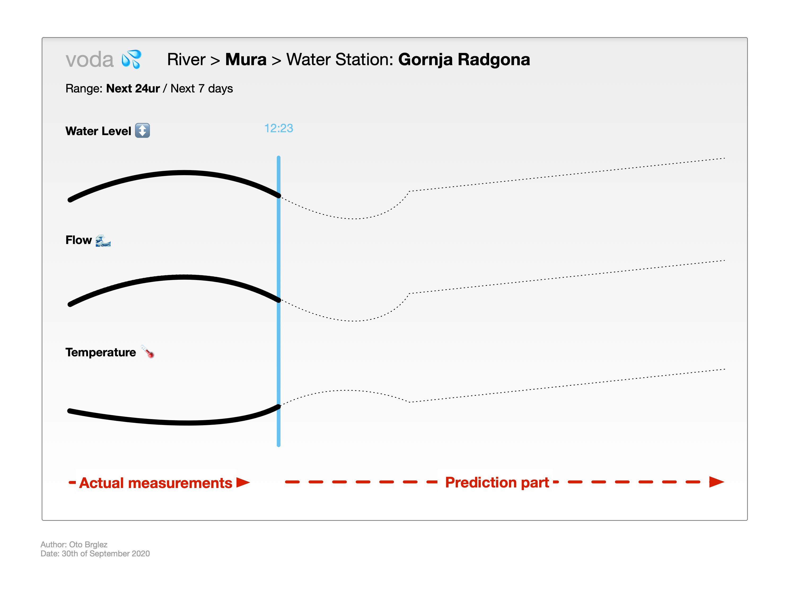
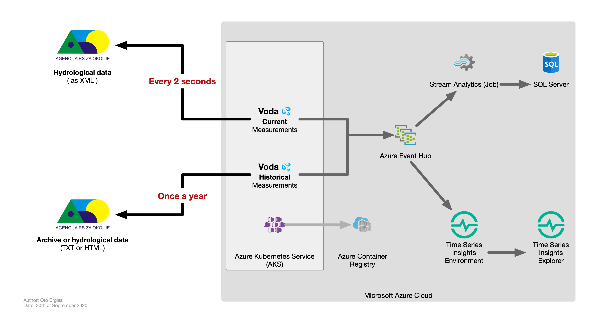

# voda 💦


> ⚠️ This is highly experimental project witten for a hackathon. Please be careful. ⚠️

Experimenting with following [ARSO](http://www.arso.gov.si) services and 
Open-data Sources,... and attempting to predict weather trends in real-time.

- [Hidrološki podatki - Dnevni v XML](http://www.arso.gov.si/xml/vode/hidro_podatki_dnevno_porocilo.xml)
- [Hidrološki podatki - Zadnji v XML](http://www.arso.gov.si/xml/vode/hidro_podatki_zadnji.xml)
- [Arhiv hidroloških podatkov - dnevni podatki - (HTML/TXT)](http://vode.arso.gov.si/hidarhiv/pov_arhiv_tab.php)

## Project
### Product Idea


### User Interface Idea


### Architecture (PoC)


### End-result 


# Deployment and development

## HELM

#### Preparing the real-time collector

The app will start to collect data from XML sources, and it will continue to do so for every 5 seconds.
The data is then shipped to Azure Event Hub for further processing.

```bash
# This is missing from repository. It contains key for Azure Event Hub.
kubectl apply -f k8s/set-keys.yaml

# Chart installation,...
helm install one chart/voda --atomic --values chart/voda/values.yaml

```
Wait a sec and collection of data will commence,...

#### Running "one-off" collection for scraping of archive

Similarly, to collector above; this collector will go over "all" the archives and process everything.
The data is also then emitted to Azure Event Hub.

```bash
kubectl apply -f k8s/start-archive-collection.yaml
```

New deployment,...

```bash
sbt docker:publish
helm upgrade one chart/voda -f chart/voda/values.yaml --set image.tag=0.1.1
```

## Usage with Docker

```bash
$ docker pull ghcr.io/pinkstack/voda:latest
$ docker run --rm ghcr.io/pinkstack/voda
```

## Development from source

```bash
$ sbt compile assembly
$ java -jar target/*/voda.jar
```

## Author

- [Oto Brglez](https://github.com/otobrglez)
